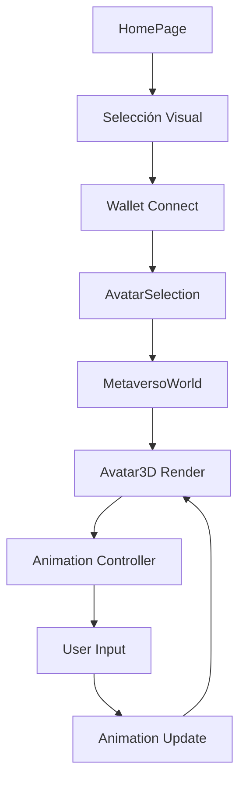

# Sistema de Avatares - Metaverso Crypto World

## 🎯 Descripción General

El sistema de avatares permite a los usuarios crear y personalizar su personaje virtual con animaciones 3D generadas por código usando Three.js. El sistema incluye selección de género, personalización visual y animaciones básicas.

## 🏗️ Arquitectura del Sistema

### Componentes Principales

1. **HomePage** (`src/components/HomePage.tsx`)
   - Página de inicio con selección visual de avatar
   - Imágenes generadas por código CSS
   - Interfaz moderna con animaciones Framer Motion

2. **AvatarSelection** (`src/components/AvatarSelection.tsx`)
   - Componente de selección detallada de avatar
   - Vista 3D en tiempo real con Three.js
   - Controles de animación y personalización

3. **Avatar3D** (dentro de AvatarSelection)
   - Renderizado 3D del avatar usando Three.js
   - Geometrías básicas (esferas, cilindros, cajas)
   - Sistema de animaciones en tiempo real

4. **MetaversoWorld** (`src/components/MetaversoWorld.tsx`)
   - Mundo 3D donde se muestra el avatar
   - Integración con el avatar seleccionado
   - Controles de movimiento y animación

### Utilidades

5. **avatarAnimations** (`src/utils/avatarAnimations.ts`)
   - Configuraciones de animaciones predefinidas
   - Controlador de animaciones
   - Sistema de keyframes e interpolación

## 🎮 Flujo de Usuario

### 1. Página de Inicio
```
Usuario llega → HomePage → Selecciona avatar visual → Comienza aventura
```

### 2. Conexión Wallet
```
Conecta MetaMask → Firma mensaje → Procede a selección detallada
```

### 3. Selección Detallada
```
AvatarSelection → Vista 3D → Personalización → Confirmación
```

### 4. Mundo Virtual
```
MetaversoWorld → Avatar 3D → Controles de movimiento → Animaciones
```

## 🎨 Características de los Avatares

### Tipos de Avatar

#### Avatar Masculino
- **Color**: Azul (#4A90E2)
- **Altura**: 1.80m
- **Características**: Explorador valiente y aventurero
- **Iconos**: ⚔️ 🛡️ 🏃

#### Avatar Femenino
- **Color**: Rosa (#E91E63)
- **Altura**: 1.65m
- **Características**: Guerrera sabia y poderosa
- **Iconos**: ✨ 🔮 ⚡

### Geometría 3D

Cada avatar está compuesto por:

```typescript
// Estructura del avatar
{
  cabeza: SphereGeometry (radio: 0.15)
  cuerpo: CylinderGeometry (radio: 0.12-0.15, altura: 0.6)
  brazos: CylinderGeometry (radio: 0.04, altura: 0.4)
  manos: SphereGeometry (radio: 0.05)
  piernas: CylinderGeometry (radio: 0.06, altura: 0.5)
  pies: BoxGeometry (0.12 x 0.08 x 0.2)
}
```

## 🎬 Sistema de Animaciones

### Animaciones Disponibles

1. **Idle (Reposo)**
   - Duración: 2 segundos
   - Easing: easeInOut
   - Loop: Sí
   - Movimiento: Respiración sutil

2. **Walk (Caminar)**
   - Duración: 1 segundo
   - Easing: linear
   - Loop: Sí
   - Movimiento: Brazos y piernas alternados

3. **Wave (Saludar)**
   - Duración: 1.5 segundos
   - Easing: easeInOut
   - Loop: No
   - Movimiento: Brazo derecho saludando

4. **Jump (Salto)**
   - Duración: 1 segundo
   - Easing: easeOut
   - Loop: No
   - Movimiento: Elevación y descenso

5. **Dance (Baile)**
   - Duración: 2 segundos
   - Easing: easeInOut
   - Loop: Sí
   - Movimiento: Rotaciones suaves

### Controlador de Animaciones

```typescript
// Uso del controlador
const controller = new AvatarAnimationController(group)

// Reproducir animación
controller.play('walk')

// Actualizar en cada frame
controller.update(deltaTime)
```

## 🎮 Controles de Usuario

### Teclas de Movimiento
- **W/↑**: Mover hacia adelante
- **S/↓**: Mover hacia atrás
- **A/←**: Mover hacia la izquierda
- **D/→**: Mover hacia la derecha
- **Espacio**: Saltar
- **Shift**: Agacharse
- **H**: Saludar (animación wave)

### Controles de UI
- **Botones de animación**: Cambiar entre idle, walk, wave
- **Controles de cámara**: OrbitControls para rotar/zoom
- **Panel de información**: Mostrar datos del avatar

## 🔧 Personalización

### Datos del Avatar

```typescript
interface AvatarData {
  type: 'male' | 'female'
  name: string
  color: string
  height: number
  animations: {
    idle: boolean
    walk: boolean
    wave: boolean
  }
}
```

### Almacenamiento

Los datos del avatar se guardan en:
- **localStorage**: `selectedAvatar` (JSON)
- **Estado de React**: `selectedAvatarData`
- **Contexto**: MetaversoContext

## 🎨 Estilos y Temas

### Colores del Sistema
```css
/* Avatar Masculino */
--male-color: #4A90E2
--male-gradient: from-blue-500 to-blue-700

/* Avatar Femenino */
--female-color: #E91E63
--female-gradient: from-pink-500 to-pink-700

/* UI Elements */
--primary: #3b82f6
--secondary: #10b981
--background: linear-gradient(120deg, #7b9cfb 0%, #6a5acd 100%)
```

### Animaciones CSS
- **Framer Motion**: Transiciones suaves
- **Hover effects**: Escalado y brillo
- **Loading states**: Spinners y skeletons

## 🚀 Implementación Técnica

### Dependencias Principales
```json
{
  "@react-three/fiber": "^8.15.0",
  "@react-three/drei": "^9.88.0",
  "three": "^0.158.0",
  "framer-motion": "^10.16.0"
}
```

### Estructura de Archivos
```
src/
├── components/
│   ├── HomePage.tsx           # Página de inicio
│   ├── AvatarSelection.tsx    # Selección de avatar
│   └── MetaversoWorld.tsx     # Mundo 3D
├── utils/
│   └── avatarAnimations.ts    # Sistema de animaciones
└── types/
    └── metaverso.ts          # Tipos de avatar
```

## 🔄 Flujo de Datos



## 🎯 Próximas Mejoras

### Funcionalidades Planificadas
1. **Más animaciones**: Correr, nadar, volar
2. **Personalización avanzada**: Ropa, accesorios, colores
3. **Física realista**: Colisiones, gravedad
4. **Multiplayer**: Avatares de otros usuarios
5. **NFT Integration**: Avatares como NFTs

### Optimizaciones Técnicas
1. **LOD System**: Niveles de detalle
2. **Instancing**: Múltiples avatares eficientes
3. **WebGL Optimizations**: Shaders personalizados
4. **Asset Streaming**: Carga progresiva

## 🐛 Solución de Problemas

### Problemas Comunes

1. **Avatar no se muestra**
   - Verificar Three.js canvas
   - Comprobar geometrías
   - Revisar iluminación

2. **Animaciones no funcionan**
   - Verificar controlador
   - Comprobar keyframes
   - Revisar timing

3. **Performance lenta**
   - Reducir polígonos
   - Optimizar texturas
   - Usar LOD

### Debugging
```typescript
// Habilitar debug
console.log('Avatar data:', selectedAvatarData)
console.log('Animation:', currentAnimation)
console.log('Controller:', controller)
```

## 📚 Recursos Adicionales

- [Three.js Documentation](https://threejs.org/docs/)
- [React Three Fiber](https://docs.pmnd.rs/react-three-fiber)
- [Framer Motion](https://www.framer.com/motion/)
- [WebGL Fundamentals](https://webglfundamentals.org/)

---

**Sistema de Avatares** - Metaverso Crypto World Virtual 3D 🌍✨ 