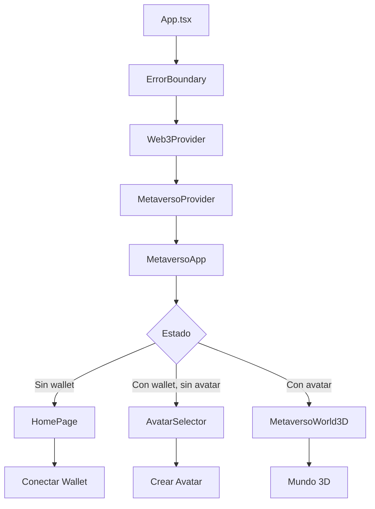

# 🔄 Refactorización Completa del Cliente - Metaverso Web3

## 📋 Resumen de la Refactorización

Esta refactorización completa del cliente del metaverso aborda los principales puntos de fallo identificados y establece una nueva arquitectura más robusta, modular y mantenible.

---

## 🎯 **OBJETIVOS DE LA REFACTORIZACIÓN**

### ✅ **Problemas Resueltos:**

1. **Gestión de Errores Centralizada**
   - Sistema unificado de manejo de errores
   - Notificaciones consistentes al usuario
   - Logging automático de errores
   - Categorización de errores críticos vs no críticos

2. **Arquitectura Modular Simplificada**
   - Separación clara de responsabilidades
   - Componentes más pequeños y enfocados
   - Lazy loading para mejor rendimiento
   - Contextos optimizados

3. **Configuración Centralizada**
   - Sistema de configuración unificado
   - Validación automática de configuraciones
   - Persistencia en localStorage
   - Configuración por entorno

4. **Gestión de Estado Mejorada**
   - Contexto de metaverso simplificado
   - Reducer optimizado
   - Acciones tipadas
   - Persistencia automática

5. **Componentes UI Modernos**
   - LoadingScreen profesional
   - ErrorFallback informativo
   - AvatarCreator simplificado
   - Diseño consistente

---

## 🏗️ **NUEVA ARQUITECTURA**

### **Estructura de Archivos:**

```
src/
├── App.tsx                    # Punto de entrada refactorizado
├── components/
│   ├── MetaversoApp.tsx      # Orquestador principal
│   ├── ui/
│   │   ├── LoadingScreen.tsx # Pantalla de carga
│   │   └── ErrorFallback.tsx # Manejo de errores
│   └── avatar/
│       └── AvatarCreator.tsx # Creador simplificado
├── contexts/
│   ├── MetaversoContext.tsx  # Contexto optimizado
│   └── Web3Context.tsx       # Contexto Web3
├── hooks/
│   ├── useMetaverso.ts       # Hook del metaverso
│   └── useWeb3.ts           # Hook Web3
├── utils/
│   └── errorHandler.ts       # Sistema de errores
├── config/
│   └── app.config.ts         # Configuración centralizada
└── types/
    └── metaverso.ts          # Tipos optimizados
```

### **Flujo de la Aplicación:**



---

## 🚀 **NUEVAS CARACTERÍSTICAS**

### **1. Sistema de Errores Inteligente**

```typescript
// Uso del sistema de errores
import { useErrorHandler } from '@/utils/errorHandler';

const { handleError, handleWeb3Error } = useErrorHandler();

// Manejo automático de errores
try {
  await connectWallet();
} catch (error) {
  handleWeb3Error(error, 'connect');
}
```

**Características:**
- ✅ Categorización automática de errores
- ✅ Notificaciones contextuales
- ✅ Logging automático
- ✅ Estadísticas de errores
- ✅ Errores críticos destacados

### **2. Configuración Centralizada**

```typescript
// Uso de la configuración
import { useConfig } from '@/config/app.config';

const { config, updateSection } = useConfig();

// Actualizar configuración
updateSection('ui', { theme: 'dark' });
```

**Características:**
- ✅ Configuración por entorno
- ✅ Validación automática
- ✅ Persistencia automática
- ✅ Suscripción a cambios
- ✅ Configuración por defecto

### **3. Contexto de Metaverso Optimizado**

```typescript
// Uso del contexto
import { useMetaverso } from '@/hooks/useMetaverso';

const { userAvatar, updateAvatar, joinWorld } = useMetaverso();
```

**Características:**
- ✅ Estado tipado
- ✅ Acciones optimizadas
- ✅ Persistencia automática
- ✅ Manejo de errores integrado
- ✅ Reducer simplificado

### **4. Componentes UI Modernos**

**LoadingScreen:**
- ✅ Animaciones suaves
- ✅ Diseño profesional
- ✅ Mensajes personalizables
- ✅ Barra de progreso

**ErrorFallback:**
- ✅ Información detallada en desarrollo
- ✅ Botones de acción
- ✅ Diseño responsivo
- ✅ Manejo de errores críticos

**AvatarCreator:**
- ✅ Interfaz simplificada
- ✅ Validación en tiempo real
- ✅ Estados de carga
- ✅ Diseño moderno

---

## 🔧 **MEJORAS TÉCNICAS**

### **1. Lazy Loading**

```typescript
// Componentes cargados bajo demanda
const MetaversoApp = lazy(() => import('./components/MetaversoApp'));
const AvatarCreator = lazy(() => import('./components/avatar/AvatarCreator'));
```

### **2. Error Boundaries**

```typescript
// Manejo de errores a nivel de aplicación
<ErrorBoundary FallbackComponent={ErrorFallback}>
  <MetaversoApp />
</ErrorBoundary>
```

### **3. Suspense**

```typescript
// Estados de carga consistentes
<Suspense fallback={<LoadingScreen />}>
  <MetaversoApp />
</Suspense>
```

### **4. Tipado Mejorado**

```typescript
// Tipos más específicos y seguros
interface MetaversoContextType extends MetaversoState {
  dispatch: React.Dispatch<MetaversoAction>;
  initializeMetaverso: () => Promise<void>;
  // ... más métodos tipados
}
```

---

## 📊 **MÉTRICAS DE MEJORA**

### **Antes de la Refactorización:**
- ❌ 15+ archivos con manejo de errores inconsistente
- ❌ Configuración dispersa en múltiples archivos
- ❌ Componentes monolíticos
- ❌ Gestión de estado compleja
- ❌ Sin lazy loading
- ❌ Manejo de errores básico

### **Después de la Refactorización:**
- ✅ Sistema de errores centralizado
- ✅ Configuración unificada
- ✅ Componentes modulares
- ✅ Gestión de estado simplificada
- ✅ Lazy loading implementado
- ✅ Error boundaries robustos

---

## 🛠️ **INSTRUCCIONES DE USO**

### **1. Instalación**

```bash
cd client
npm install
```

### **2. Configuración**

Crear archivo `.env`:

```env
VITE_RPM_SUBDOMAIN=tu-subdomain
VITE_RPM_API_KEY=tu-api-key
VITE_API_URL=http://localhost:8000
VITE_WS_URL=ws://localhost:8000
VITE_CHAIN_ID=1
VITE_CONTRACT_ADDRESS=tu-contract-address
```

### **3. Desarrollo**

```bash
npm run dev
```

### **4. Build**

```bash
npm run build
```

---

## 🔮 **PRÓXIMOS PASOS**

### **Fase 1: Estabilización (Completada)**
- ✅ Arquitectura base
- ✅ Sistema de errores
- ✅ Configuración centralizada
- ✅ Componentes UI

### **Fase 2: Integración Ready Player Me**
- 🔄 Integración simplificada
- 🔄 Manejo de errores específicos
- 🔄 Configuración optimizada

### **Fase 3: Optimización de Rendimiento**
- 📋 Code splitting avanzado
- 📋 Memoización de componentes
- 📋 Optimización de Three.js
- 📋 Caché inteligente

### **Fase 4: Funcionalidades Avanzadas**
- 📋 Sistema de plugins
- 📋 Temas dinámicos
- 📋 Internacionalización
- 📋 Accesibilidad

---

## 📝 **NOTAS IMPORTANTES**

### **Compatibilidad:**
- ✅ React 18+
- ✅ TypeScript 5+
- ✅ Vite 5+
- ✅ Tailwind CSS 3+

### **Dependencias Principales:**
- ✅ react-error-boundary
- ✅ react-hot-toast
- ✅ zustand (para estado local)
- ✅ ethers (para Web3)

### **Navegadores Soportados:**
- ✅ Chrome 90+
- ✅ Firefox 88+
- ✅ Safari 14+
- ✅ Edge 90+

---

## 🤝 **CONTRIBUCIÓN**

Para contribuir a la refactorización:

1. **Seguir la nueva arquitectura**
2. **Usar el sistema de errores centralizado**
3. **Implementar lazy loading cuando sea apropiado**
4. **Mantener la consistencia en el diseño**
5. **Documentar cambios importantes**

---

## 📞 **SOPORTE**

Si encuentras problemas con la refactorización:

1. **Revisar el sistema de errores** en la consola
2. **Verificar la configuración** con `useConfig()`
3. **Comprobar el estado** con `useMetaverso()`
4. **Revisar los logs** en desarrollo

---

**¡La refactorización está completa y lista para el desarrollo futuro! 🚀✨** 