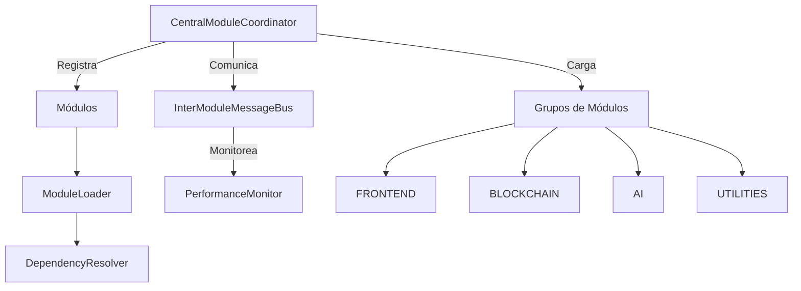

# Core Modular System - WoldVirtual3DlucIA

## 📋 Descripción General

El **Core Modular System** es el núcleo central del metaverso WoldVirtual3DlucIA, diseñado para gestionar la carga dinámica y comunicación entre módulos de diferentes lenguajes de programación. Este sistema implementa una arquitectura ultra-modular que permite la distribución inteligente de responsabilidades.

## 🏗️ Arquitectura del Sistema

### Componentes Principales

```
core/
├── CentralModuleCoordinator.ts    # Coordinador central del sistema
├── InterModuleMessageBus.ts       # Bus de comunicación inter-módulo
├── ModuleLoader.ts                # Cargador de módulos multi-lenguaje
├── DependencyResolver.ts          # Resolvedor de dependencias
├── PerformanceMonitor.ts          # Monitor de rendimiento
├── types/
│   └── core.ts                    # Definiciones de tipos
└── README.md                      # Este archivo
```

### Flujo de Funcionamiento



## 🚀 Componentes Detallados

### 1. CentralModuleCoordinator

**Responsabilidades:**
- Descubrimiento automático de módulos
- Gestión de carga por grupos funcionales
- Coordinación entre diferentes lenguajes
- Registro centralizado de componentes

**Características:**
- Patrón Singleton para instancia única
- Carga lazy de módulos bajo demanda
- Gestión de dependencias automática
- Optimización de recursos

```typescript
// Ejemplo de uso
const coordinator = CentralModuleCoordinator.getInstance();
await coordinator.loadModuleGroupForUser('FRONTEND', 'user-123');
```

### 2. InterModuleMessageBus

**Responsabilidades:**
- Comunicación pub/sub entre módulos
- Enrutamiento de mensajes por prioridad
- Gestión de colas de mensajes
- Retry automático para mensajes fallidos

**Características:**
- Sistema de prioridades (LOW, NORMAL, HIGH, CRITICAL)
- Historial de mensajes con filtros
- Métricas de rendimiento de comunicación
- Limpieza automática de recursos

```typescript
// Ejemplo de uso
const messageBus = InterModuleMessageBus.getInstance();
messageBus.publish('component-request', {
  type: 'load-component',
  data: { componentName: 'UserProfile' },
  priority: MessagePriority.HIGH
});
```

### 3. ModuleLoader

**Responsabilidades:**
- Carga de módulos TypeScript/JavaScript
- Carga de módulos Python (simulada)
- Carga de módulos Go (simulada)
- Validación y pre/post-procesamiento

**Características:**
- Soporte multi-lenguaje
- Caché de módulos cargados
- Historial de carga y errores
- Carga paralela con límite de concurrencia

```typescript
// Ejemplo de uso
const loader = new ModuleLoader({
  language: 'typescript',
  extensions: ['.ts', '.tsx'],
  loader: async (filePath) => { /* lógica de carga */ }
});
const module = await loader.load('./path/to/module.ts');
```

### 4. DependencyResolver

**Responsabilidades:**
- Análisis de dependencias entre módulos
- Ordenamiento topológico para carga
- Detección de dependencias circulares
- Validación de dependencias

**Características:**
- Algoritmo de ordenamiento topológico
- Detección automática de ciclos
- Generación de niveles de dependencias
- Estadísticas del grafo de dependencias

```typescript
// Ejemplo de uso
const resolver = new DependencyResolver();
const loadOrder = resolver.resolveLoadOrder(['web', 'components'], modules);
```

### 5. PerformanceMonitor

**Responsabilidades:**
- Monitoreo de tiempo de carga
- Seguimiento de uso de memoria
- Métricas de comunicación
- Alertas de rendimiento

**Características:**
- Métricas en tiempo real
- Umbrales de alerta configurables
- Reportes de rendimiento
- Recomendaciones automáticas

```typescript
// Ejemplo de uso
const monitor = new PerformanceMonitor();
monitor.recordMetric('loadTime', 1500, 'web-module');
const report = monitor.generatePerformanceReport();
```

## 📦 Grupos de Módulos

### Definición de Grupos

```typescript
export const ModuleGroups = {
  CORE: ['config', 'data', 'models', 'services', 'middlewares'],
  FRONTEND: ['web', 'pages', 'components', 'css', 'fonts', 'public'],
  BLOCKCHAIN: ['bloc', 'assets', 'entities'],
  AI: ['ini', 'js', 'test'],
  UTILITIES: ['helpers', 'cli', 'scripts', 'lib', 'languages'],
  MEDIA: ['image', 'fonts', 'css', 'public'],
  EDITOR_3D: ['.bin', 'components', 'web', 'js'],
  CLIENT: ['client', 'components', 'web', 'services'],
  TESTING: ['test', 'coverage', 'scripts'],
  DOCUMENTATION: ['docs', 'README', 'examples']
};
```

### Carga Contextual

El sistema carga módulos según el contexto del usuario:

- **Autenticación**: Carga `CORE` + `BLOCKCHAIN`
- **Editor 3D**: Carga `EDITOR_3D` + `MEDIA`
- **Chat IA**: Carga `AI` + `FRONTEND`
- **Marketplace NFT**: Carga `BLOCKCHAIN` + `MEDIA` + `FRONTEND`

## 🔧 Configuración

### Configuración por Defecto

```typescript
const DEFAULT_MODULAR_CONFIG = {
  autoDiscovery: true,
  lazyLoading: true,
  preloadCritical: true,
  maxConcurrentLoads: 5,
  timeoutMs: 30000,
  retryAttempts: 3,
  cacheEnabled: true,
  cacheSize: 100,
  cacheTTL: 300000,
  performanceMonitoring: true,
  errorReporting: true,
  debugMode: false,
  languages: ['typescript', 'python', 'go', 'rust'],
  defaultLanguage: 'typescript',
  fallbackLanguage: 'javascript'
};
```

## 📊 Métricas y Monitoreo

### Métricas Disponibles

- **Tiempo de carga**: Duración de carga de módulos
- **Uso de memoria**: Consumo de memoria por módulo
- **Tiempo de respuesta**: Latencia de comunicación
- **Tasa de errores**: Porcentaje de errores
- **Throughput**: Operaciones por segundo

### Alertas Automáticas

- **Alta**: Umbral excedido en más del 200%
- **Media**: Umbral excedido en más del 150%
- **Baja**: Umbral excedido en más del 100%

## 🚀 Inicialización del Sistema

### Ejemplo Completo

```typescript
import { centralCoordinator } from './core/CentralModuleCoordinator';
import { interModuleBus } from './core/InterModuleMessageBus';

async function initializeSystem() {
  try {
    // Inicializar coordinador central
    await centralCoordinator.initialize();
    
    // Inicializar bus de mensajes
    await interModuleBus.initialize();
    
    // Cargar módulos críticos
    await centralCoordinator.loadModuleGroupForUser('CORE', 'system');
    
    console.log('✅ Sistema modular inicializado correctamente');
    
  } catch (error) {
    console.error('❌ Error inicializando sistema:', error);
    throw error;
  }
}

// Inicializar sistema
initializeSystem();
```

## 🔄 Patrones de Uso

### 1. Carga de Módulos por Usuario

```typescript
// Cargar módulos frontend para un usuario
await centralCoordinator.loadModuleGroupForUser('FRONTEND', userId);

// Obtener API de un módulo específico
const webAPI = centralCoordinator.getModulePublicAPI('web');
const component = webAPI.getComponent('UserProfile');
```

### 2. Comunicación Inter-Módulo

```typescript
// Suscribirse a eventos
const unsubscribe = interModuleBus.subscribe('component-request', (event) => {
  console.log('Componente solicitado:', event.data.componentName);
});

// Publicar mensaje
interModuleBus.publish('component-request', {
  type: 'load-component',
  data: { componentName: 'NFTGallery' },
  priority: MessagePriority.HIGH
});
```

### 3. Monitoreo de Rendimiento

```typescript
// Registrar métricas
performanceMonitor.recordMetric('loadTime', 1200, 'web-module');
performanceMonitor.recordMetric('memoryUsage', 50 * 1024 * 1024, 'ai-module');

// Generar reporte
const report = performanceMonitor.generatePerformanceReport();
console.log('Reporte de rendimiento:', report);
```

## 🛠️ Desarrollo y Extensión

### Agregar Nuevo Lenguaje

1. **Crear cargador específico**:
```typescript
const rustLoader = new ModuleLoader({
  language: 'rust',
  extensions: ['.rs'],
  loader: async (filePath) => {
    // Implementar carga de módulos Rust
  }
});
```

2. **Registrar en coordinador**:
```typescript
centralCoordinator.moduleLoaders.set('rust', rustLoader);
```

### Agregar Nuevo Grupo de Módulos

1. **Definir grupo**:
```typescript
export const ModuleGroups = {
  // ... grupos existentes
  NEW_GROUP: ['module1', 'module2', 'module3']
};
```

2. **Implementar lógica de carga**:
```typescript
await centralCoordinator.loadModuleGroupForUser('NEW_GROUP', userId);
```

## 📈 Optimizaciones

### Estrategias de Optimización

1. **Carga Lazy**: Módulos se cargan solo cuando se necesitan
2. **Caché Inteligente**: Módulos frecuentemente usados se mantienen en memoria
3. **Carga Paralela**: Módulos independientes se cargan simultáneamente
4. **Precarga Crítica**: Módulos esenciales se precargan

### Monitoreo de Rendimiento

- **Métricas en tiempo real** para identificar cuellos de botella
- **Alertas automáticas** cuando se exceden umbrales
- **Reportes periódicos** para análisis de tendencias
- **Recomendaciones automáticas** para optimización

## 🔒 Seguridad

### Medidas de Seguridad

1. **Validación de módulos**: Verificación de integridad antes de la carga
2. **Aislamiento**: Módulos se ejecutan en contextos separados
3. **Control de acceso**: APIs públicas e internas bien definidas
4. **Auditoría**: Logs detallados de todas las operaciones

## 🧪 Testing

### Estrategias de Testing

1. **Unit Tests**: Cada componente tiene tests unitarios
2. **Integration Tests**: Tests de integración entre módulos
3. **Performance Tests**: Tests de rendimiento y carga
4. **Security Tests**: Tests de seguridad y validación

### Ejemplo de Test

```typescript
describe('CentralModuleCoordinator', () => {
  it('should load module group correctly', async () => {
    const coordinator = CentralModuleCoordinator.getInstance();
    await coordinator.loadModuleGroupForUser('FRONTEND', 'test-user');
    
    expect(coordinator.getStats().activeModules).toBeGreaterThan(0);
  });
});
```

## 📚 Documentación Adicional

- [Tipos y Interfaces](./types/core.ts)
- [Ejemplos de Uso](./examples/)
- [Guía de Contribución](./CONTRIBUTING.md)
- [Changelog](./CHANGELOG.md)

## 🤝 Contribución

Para contribuir al sistema modular:

1. **Fork** el repositorio
2. **Crea** una rama para tu feature
3. **Implementa** siguiendo las reglas de 200-300 líneas
4. **Testea** exhaustivamente
5. **Documenta** los cambios
6. **Envía** un pull request

## 📄 Licencia

Este proyecto está bajo la licencia MIT. Ver [LICENSE](../LICENSE) para más detalles.

---

**Desarrollado con ❤️ para WoldVirtual3DlucIA** 