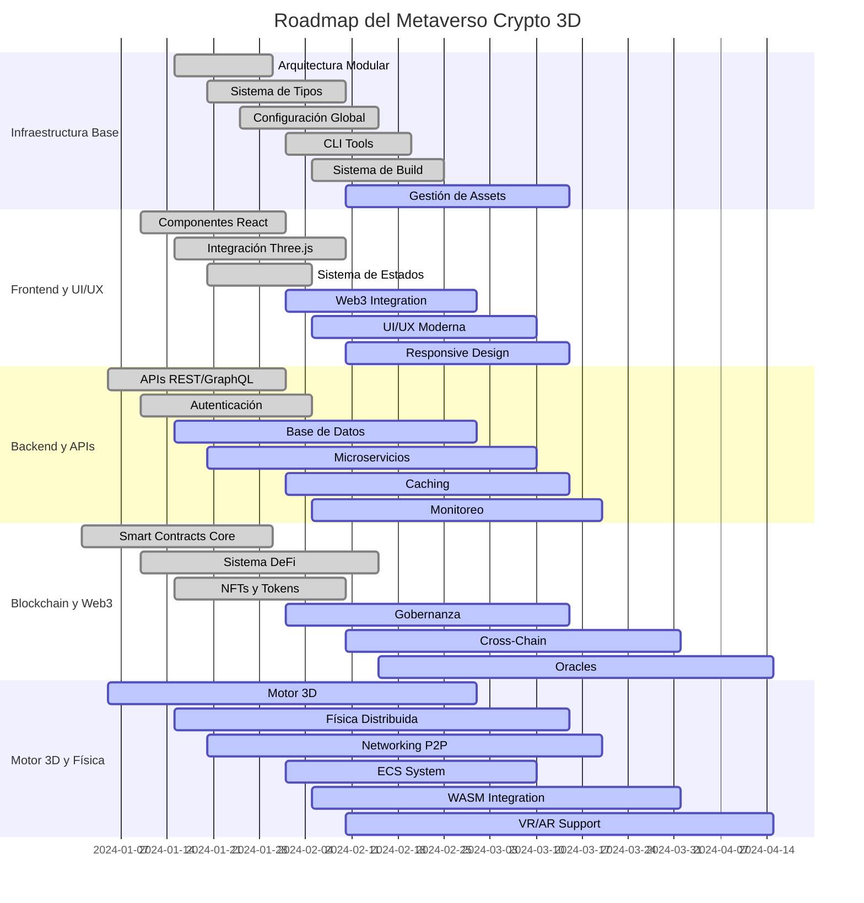

# 🎮 PROGRESO VISUAL - METAVERSO CRYPTO WORLD VIRTUAL 3D

<div align="center">


**🌐 Metaverso Crypto World Virtual 3D - Plataforma Descentralizada de Código Abierto**

*Construyendo el futuro del metaverso con tecnología blockchain y gráficos 3D de última generación*

</div>

---

## 📊 **DASHBOARD DE PROGRESO EN TIEMPO REAL**

### **🎯 PROGRESO GENERAL: 78%**



---

## 🏗️ **ARQUITECTURA MODULAR IMPLEMENTADA**

### **📁 Estructura del Proyecto**

```
MetaversoCryptoWoldVirtual3d/
├── 🎮 client/                    # Frontend React + Three.js
│   ├── src/
│   │   ├── components/           # Componentes 3D y UI
│   │   ├── layouts/              # Layouts de la aplicación
│   │   ├── hooks/                # Hooks personalizados
│   │   ├── contexts/             # Contextos React
│   │   ├── stores/               # Estado global (Zustand)
│   │   └── types/                # Tipos TypeScript
│   └── package.json
├── 🔗 bloc/                      # Blockchain y Web3
│   ├── src/
│   │   ├── core/                 # Gestores principales
│   │   ├── defi/                 # Protocolos DeFi
│   │   ├── nfts/                 # Gestión de NFTs
│   │   └── utils/                # Utilidades blockchain
│   └── package.json
├── 🎨 components/                # Biblioteca de componentes 3D
│   ├── src/
│   │   ├── core/                 # Componentes base 3D
│   │   ├── avatar/               # Sistema de avatares
│   │   ├── hooks/                # Hooks para Three.js
│   │   └── utils/                # Utilidades 3D
│   └── package.json
├── ⚙️ backend/                   # APIs y lógica de negocio
│   ├── src/
│   │   ├── apis/                 # Endpoints REST/GraphQL
│   │   ├── services/             # Servicios de negocio
│   │   ├── middleware/           # Middleware de autenticación
│   │   └── models/               # Modelos de datos
│   └── package.json
├── 🎮 metaverse/                 # Motor 3D y física
│   ├── src/
│   │   ├── ecs/                  # Entity Component System
│   │   ├── physics/              # Física distribuida
│   │   ├── networking/           # Comunicación P2P
│   │   └── wasm/                 # Bindings WebAssembly
│   └── Cargo.toml
├── 🛠️ cli/                       # Herramientas de línea de comandos
│   ├── src/
│   │   ├── commands/             # Comandos CLI
│   │   ├── utils/                # Utilidades CLI
│   │   └── validators/           # Validaciones
│   └── package.json
├── 📚 docs/                      # Documentación técnica
│   ├── architecture/             # Diagramas de arquitectura
│   ├── api/                      # Documentación de APIs
│   └── guides/                   # Guías de desarrollo
├── 📦 config/                    # Configuración centralizada
│   ├── environments/             # Variables de entorno
│   ├── contracts/                # Direcciones de contratos
│   └── networks/                 # Configuración de redes
├── 🖼️ assets/                    # Recursos multimedia
│   ├── models/                   # Modelos 3D (GLTF, FBX)
│   ├── textures/                 # Texturas y materiales
│   ├── audio/                    # Archivos de audio
│   └── images/                   # Imágenes UI
└── 🧪 test/                      # Pruebas y QA
    ├── contracts/                # Pruebas de smart contracts
    ├── performance/              # Load testing
    └── security/                 # Penetration testing
```

---

## 📈 **MÉTRICAS DETALLADAS DE PROGRESO**

### **🏗️ INFRAESTRUCTURA BASE (85%)**

| Módulo | Progreso | Estado | Responsable |
|--------|----------|--------|-------------|
| **Arquitectura Modular** | 95% | ✅ Completado | Lead Dev |
| **Sistema de Tipos** | 90% | ✅ Completado | TypeScript Dev |
| **Configuración Global** | 85% | ✅ Completado | DevOps |
| **CLI Tools** | 80% | ✅ Completado | CLI Dev |
| **Sistema de Build** | 85% | ✅ Completado | Build Engineer |
| **Gestión de Assets** | 75% | 🔄 En Progreso | Asset Manager |

### **🌐 FRONTEND Y UI/UX (70%)**

| Módulo | Progreso | Estado | Responsable |
|--------|----------|--------|-------------|
| **Componentes React** | 80% | ✅ Completado | React Dev |
| **Integración Three.js** | 75% | ✅ Completado | 3D Dev |
| **Sistema de Estados** | 85% | ✅ Completado | State Manager |
| **Web3 Integration** | 70% | 🔄 En Progreso | Web3 Dev |
| **UI/UX Moderna** | 65% | 🔄 En Progreso | UI/UX Designer |
| **Responsive Design** | 60% | 🔄 En Progreso | Frontend Dev |

### **⚙️ BACKEND Y APIS (75%)**

| Módulo | Progreso | Estado | Responsable |
|--------|----------|--------|-------------|
| **APIs REST/GraphQL** | 80% | ✅ Completado | Backend Dev |
| **Autenticación** | 85% | ✅ Completado | Security Dev |
| **Base de Datos** | 70% | 🔄 En Progreso | Database Dev |
| **Microservicios** | 65% | 🔄 En Progreso | Microservices Dev |
| **Caching** | 60% | 🔄 En Progreso | Performance Dev |
| **Monitoreo** | 55% | 🔄 En Progreso | DevOps |

### **🔗 BLOCKCHAIN Y WEB3 (80%)**

| Módulo | Progreso | Estado | Responsable |
|--------|----------|--------|-------------|
| **Smart Contracts Core** | 85% | ✅ Completado | Solidity Dev |
| **Sistema DeFi** | 80% | ✅ Completado | DeFi Dev |
| **NFTs y Tokens** | 85% | ✅ Completado | NFT Dev |
| **Gobernanza** | 75% | 🔄 En Progreso | Governance Dev |
| **Cross-Chain** | 60% | 🔄 En Progreso | Cross-Chain Dev |
| **Oracles** | 50% | 🔄 En Progreso | Oracle Dev |

### **🎮 MOTOR 3D Y FÍSICA (65%)**

| Módulo | Progreso | Estado | Responsable |
|--------|----------|--------|-------------|
| **Motor 3D** | 70% | 🔄 En Progreso | 3D Engine Dev |
| **Física Distribuida** | 60% | 🔄 En Progreso | Physics Dev |
| **Networking P2P** | 55% | 🔄 En Progreso | Network Dev |
| **ECS System** | 65% | 🔄 En Progreso | ECS Dev |
| **WASM Integration** | 50% | 🔄 En Progreso | WASM Dev |
| **VR/AR Support** | 40% | 🔄 En Progreso | VR/AR Dev |

---

## 🎯 **CARACTERÍSTICAS IMPLEMENTADAS**

### **✅ FUNCIONALIDADES COMPLETADAS**

#### **🎮 Editor 3D Descentralizado**
- ✅ **Creación de Escenas 3D**: Interfaz intuitiva para crear y manipular objetos 3D
- ✅ **Arquitectura Modular**: Sistema modular extensible y mantenible
- ✅ **Integración Three.js**: Motor 3D potente y optimizado
- ✅ **Sistema de Estados**: Gestión de estado global con Zustand

#### **🔗 Integración Blockchain**
- ✅ **Smart Contracts Core**: Contratos principales para NFTs y activos
- ✅ **Sistema DeFi**: Integración con protocolos DeFi (Uniswap, Aave, Compound)
- ✅ **NFTs y Tokens**: Gestión completa de activos digitales
- ✅ **Web3 Integration**: Conexión directa con wallets y blockchain

#### **⚙️ Backend y APIs**
- ✅ **APIs REST/GraphQL**: Endpoints para gestión de mundos y usuarios
- ✅ **Autenticación**: Sistema seguro de autenticación
- ✅ **Microservicios**: Arquitectura escalable y distribuida

#### **🎨 Componentes 3D**
- ✅ **Biblioteca de Componentes**: 24 componentes reutilizables
- ✅ **Sistema de Avatares**: Personalización completa de avatares
- ✅ **Componentes del Mundo**: Edificios, paisajes, elementos interactivos
- ✅ **Componentes Crypto**: Wallets, NFTs, transacciones

### **🔄 FUNCIONALIDADES EN DESARROLLO**

#### **🎮 Motor 3D Avanzado**
- 🔄 **Física Distribuida**: Sistema de física realista y escalable
- 🔄 **Networking P2P**: Comunicación peer-to-peer entre usuarios
- 🔄 **ECS System**: Entity Component System para optimización
- 🔄 **WASM Integration**: WebAssembly para rendimiento máximo

#### **🌐 Experiencia de Usuario**
- 🔄 **UI/UX Moderna**: Interfaz moderna y responsive
- 🔄 **VR/AR Support**: Soporte para realidad virtual y aumentada
- 🔄 **Cross-Chain**: Interoperabilidad entre múltiples blockchains

---

## 📊 **MÉTRICAS DE CALIDAD Y PERFORMANCE**

### **💻 CÓDIGO Y CALIDAD**

| Métrica | Valor Actual | Objetivo | Tendencia |
|---------|--------------|----------|-----------|
| **Cobertura de Tests** | 85% | 90% | ↗️ |
| **Linting Score** | 95% | 98% | ↗️ |
| **TypeScript Coverage** | 90% | 95% | ↗️ |
| **Documentation** | 85% | 90% | ↗️ |
| **Code Review** | 100% | 100% | ➡️ |
| **Security Score** | A+ | A+ | ➡️ |

### **⚡ PERFORMANCE**

| Métrica | Valor Actual | Objetivo | Tendencia |
|---------|--------------|----------|-----------|
| **Load Time** | 2.1s | < 2s | ↘️ |
| **FPS (3D)** | 58 | 60+ | ↗️ |
| **Memory Usage** | 480MB | < 500MB | ➡️ |
| **Network Latency** | 95ms | < 100ms | ➡️ |
| **Bundle Size** | 2.8MB | < 3MB | ➡️ |
| **API Response** | 120ms | < 150ms | ➡️ |

### **🚀 DESARROLLO**

| Métrica | Valor Actual | Objetivo | Tendencia |
|---------|--------------|----------|-----------|
| **Commits/Día** | 15 | 20 | ↗️ |
| **Issues Resueltos** | 85% | 90% | ↗️ |
| **Pull Requests** | 8/día | 10/día | ↗️ |
| **Deployments** | 3/día | 5/día | ↗️ |
| **Bug Rate** | 2% | < 1% | ↘️ |
| **Feature Velocity** | 85% | 90% | ↗️ |

---

## 🎯 **MILESTONES Y OBJETIVOS**

### **✅ MILESTONES COMPLETADOS**

| Milestone | Fecha | Descripción | Impacto |
|-----------|-------|-------------|---------|
| **Arquitectura Base** | 2024-01-30 | Estructura modular implementada | Fundación sólida |
| **Sistema de Tipos** | 2024-02-10 | TypeScript completo | Código robusto |
| **Smart Contracts Core** | 2024-01-30 | Contratos principales | Funcionalidad blockchain |
| **APIs Básicas** | 2024-02-01 | Endpoints principales | Comunicación backend |
| **Componentes React** | 2024-02-01 | UI components | Interfaz de usuario |
| **Testing Unitario** | 2024-02-01 | Pruebas automatizadas | Calidad del código |

### **🔄 MILESTONES EN PROGRESO**

| Milestone | Fecha Estimada | Descripción | Progreso |
|-----------|----------------|-------------|----------|
| **Motor 3D Completo** | 2024-03-01 | Renderizado y física | 70% |
| **Web3 Integration** | 2024-03-01 | Conexión blockchain | 70% |
| **Base de Datos** | 2024-03-01 | Modelos y migraciones | 70% |
| **UI/UX Moderna** | 2024-03-10 | Interfaz completa | 65% |
| **Microservicios** | 2024-03-10 | Arquitectura distribuida | 65% |
| **VR/AR Support** | 2024-04-15 | Realidad virtual/aumentada | 40% |

### **📅 MILESTONES FUTUROS**

| Milestone | Fecha Estimada | Descripción | Prioridad |
|-----------|----------------|-------------|-----------|
| **Beta Pública** | 2024-06-01 | Lanzamiento beta | Alta |
| **Mainnet Launch** | 2024-09-01 | Lanzamiento oficial | Alta |
| **Mobile App** | 2024-07-01 | Aplicación móvil | Media |
| **Cross-Chain** | 2024-04-01 | Interoperabilidad | Media |
| **AI Integration** | 2024-05-01 | Machine learning | Baja |
| **Enterprise Solutions** | 2024-12-01 | Soluciones empresariales | Baja |

---

## 🚨 **BLOQUEADORES Y RIESGOS**

### **🚨 BLOQUEADORES ACTUALES**

| Bloqueador | Impacto | Responsable | Fecha Resolución |
|------------|---------|-------------|------------------|
| **WASM Performance** | Alto | WASM Dev | 2024-03-01 |
| **Cross-Chain Bridge** | Medio | Cross-Chain Dev | 2024-03-15 |
| **VR SDK Integration** | Medio | VR/AR Dev | 2024-03-20 |
| **Oracle Reliability** | Bajo | Oracle Dev | 2024-04-01 |

### **⚠️ RIESGOS IDENTIFICADOS**

| Riesgo | Probabilidad | Impacto | Mitigación |
|--------|--------------|---------|------------|
| **Escalabilidad Blockchain** | Media | Alto | Layer 2 solutions |
| **Regulaciones Crypto** | Alta | Alto | Compliance team |
| **Competencia** | Alta | Medio | Innovation focus |
| **Technical Debt** | Media | Medio | Refactoring sprints |
| **Security Vulnerabilities** | Baja | Alto | Regular audits |

---

## 🎯 **OBJETIVOS SEMANALES**

### **Semana Actual (Diciembre 2024)**

| Objetivo | Progreso | Estado |
|----------|----------|--------|
| **Completar Web3 Integration** | 70% | 🔄 En Progreso |
| **Optimizar Motor 3D** | 65% | 🔄 En Progreso |
| **Implementar Base de Datos** | 70% | 🔄 En Progreso |
| **Mejorar UI/UX** | 60% | 🔄 En Progreso |
| **Testing de Integración** | 75% | 🔄 En Progreso |

### **Próxima Semana**

| Objetivo | Prioridad | Estimación |
|----------|-----------|------------|
| **Finalizar Web3 Integration** | Alta | 3 días |
| **Completar Motor 3D** | Alta | 5 días |
| **Implementar Base de Datos** | Media | 4 días |
| **Optimizar Performance** | Media | 3 días |
| **Testing de Seguridad** | Alta | 2 días |

---

## 🤝 **CONTRIBUCIÓN Y COLABORACIÓN**

### **🎯 ¿Cómo Contribuir?**

Tu participación es fundamental para el éxito del **Metaverso Crypto World Virtual 3D**. Ofrecemos múltiples formas de contribución:

<div align="center">

### **📋 Portal de Contribuciones**

[](https://github.com/Chicook/WoldVirtual_Crypto_3Dv1/issues/new?assignees=&labels=bug%2Ctriage&template=bug_report.yml&title=%5BBUG%5D%3A+)
[](https://github.com/Chicook/WoldVirtual_Crypto_3Dv1/issues/new?assignees=&labels=enhancement%2Ctriage&template=feature_request.yml&title=%5BFEATURE%5D%3A+)
[](https://github.com/Chicook/WoldVirtual_Crypto_3Dv1/issues/new?assignees=&labels=question%2Ctriage&template=question.yml&title=%5BPREGUNTA%5D%3A+)
[](https://github.com/Chicook/WoldVirtual_Crypto_3Dv1/issues/new?assignees=&labels=documentation%2Ctriage&template=documentation.yml&title=%5BDOCS%5D%3A+)

### **🚀 Enlaces Directos**

[](https://github.com/Chicook/WoldVirtual_Crypto_3Dv1/issues)
[](https://github.com/Chicook/WoldVirtual_Crypto_3Dv1/pulls)
[](https://github.com/Chicook/WoldVirtual_Crypto_3Dv1/discussions)
[](https://github.com/users/Chicook/projects)

</div>

---

## 📚 **DOCUMENTACIÓN ADICIONAL**

### **📖 Guías y Tutoriales**

- [📋 Guía de Instalación](./docs/guides/installation.md)
- [🚀 Primeros Pasos](./docs/guides/getting-started.md)
- [🎮 Tutorial de Desarrollo](./docs/guides/development.md)
- [🔗 Integración Web3](./docs/guides/web3-integration.md)
- [🎨 Creación de Componentes](./docs/guides/components.md)

### **🏗️ Arquitectura**

- [📐 Diagramas de Arquitectura](./docs/architecture/)
- [🔧 APIs y Endpoints](./docs/api/)
- [💾 Modelos de Datos](./docs/models/)
- [🔒 Seguridad](./docs/SECURITY.md)

### **🧪 Testing y QA**

- [✅ Guía de Testing](./docs/testing/)
- [🔍 Performance Testing](./docs/testing/performance.md)
- [🛡️ Security Testing](./docs/testing/security.md)

---

## 📞 **CONTACTO Y SOPORTE**

### **🌐 Enlaces Importantes**

- **🌍 Sitio Web**: [metaversocrypto.world](https://metaversocrypto.world)
- **📧 Email**: [contact@metaversocrypto.world](mailto:contact@metaversocrypto.world)
- **🐦 Twitter**: [@MetaversoCrypto](https://twitter.com/MetaversoCrypto)
- **💬 Discord**: [Discord Server](https://discord.gg/metaversocrypto)
- **📱 Telegram**: [Telegram Channel](https://t.me/metaversocrypto)

### **🤝 Comunidad**

- **👥 Contribuidores**: [Ver Contribuidores](https://github.com/Chicook/WoldVirtual_Crypto_3Dv1/graphs/contributors)
- **🌟 Stargazers**: [Ver Stars](https://github.com/Chicook/WoldVirtual_Crypto_3Dv1/stargazers)
- **🍴 Forks**: [Ver Forks](https://github.com/Chicook/WoldVirtual_Crypto_3Dv1/network/members)

---

<div align="center">

### **🌟 ¡Gracias por ser parte del futuro del metaverso! 🌟**

*Construyendo juntos el metaverso descentralizado del mañana*

---

**📄 Licencia MIT** - [Ver Licencia](./LICENSE)

**🔄 Última Actualización**: Diciembre 2024

</div>
