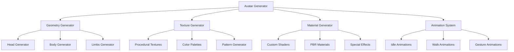

# Sistema de Generación de Avatares - Three.js Metaverso

## Descripción General

El Sistema de Generación de Avatares es una solución completa y 100% original para crear avatares únicos en Three.js. Utiliza generación procedural para crear geometrías, texturas y materiales únicos para cada avatar.

## Características Principales

### 🎨 Generación Procedural
- Geometrías únicas generadas algorítmicamente
- Texturas procedurales originales
- Materiales personalizados con shaders
- Colores y patrones únicos

### 🤖 Personalización Avanzada
- Múltiples partes del cuerpo (cabeza, torso, extremidades)
- Diferentes estilos y proporciones
- Animaciones personalizadas
- Expresiones faciales dinámicas

### ⚡ Rendimiento Optimizado
- Geometrías optimizadas automáticamente
- LOD (Level of Detail) dinámico
- Instancing para múltiples avatares
- Caché inteligente de recursos

## Arquitectura del Sistema



## Componentes del Sistema

### 1. Generador de Geometrías
- **Cabeza**: Formas únicas con diferentes proporciones
- **Cuerpo**: Torsos con variaciones de tamaño y forma
- **Extremidades**: Brazos y piernas con diferentes longitudes
- **Detalles**: Ojos, nariz, boca, orejas procedurales

### 2. Generador de Texturas
- **Piel**: Texturas procedurales únicas
- **Ropa**: Patrones y colores generados algorítmicamente
- **Accesorios**: Detalles como tatuajes, cicatrices, etc.
- **Efectos**: Brillo, transparencia, efectos especiales

### 3. Generador de Materiales
- **Shaders Personalizados**: Efectos únicos por avatar
- **PBR Materials**: Materiales físicamente correctos
- **Efectos Especiales**: Hologramas, metálico, cristal
- **Animaciones de Material**: Cambios dinámicos de apariencia

### 4. Sistema de Animaciones
- **Idle**: Animaciones de reposo únicas
- **Walk**: Estilos de caminar personalizados
- **Gestos**: Movimientos de manos y expresiones
- **Emociones**: Cambios de expresión facial

## Uso Básico

```javascript
// Crear generador de avatares
const avatarGenerator = new AvatarGenerator();

// Generar avatar único
const avatar = await avatarGenerator.generateAvatar({
    seed: 'unique_seed_123',
    style: 'cyberpunk',
    gender: 'neutral',
    height: 'tall',
    build: 'athletic'
});

// Agregar a la escena
scene.add(avatar.mesh);

// Animar avatar
avatar.animations.play('idle');
```

## Configuración Avanzada

### Opciones de Generación
```javascript
const options = {
    // Semilla para generación reproducible
    seed: 'unique_identifier',
    
    // Estilo del avatar
    style: 'cyberpunk' | 'fantasy' | 'realistic' | 'abstract',
    
    // Características físicas
    gender: 'male' | 'female' | 'neutral',
    height: 'short' | 'average' | 'tall',
    build: 'slim' | 'average' | 'athletic' | 'heavy',
    
    // Personalización
    hairStyle: 'short' | 'long' | 'bald' | 'spiky',
    eyeColor: 'blue' | 'green' | 'brown' | 'red',
    skinTone: 'light' | 'medium' | 'dark' | 'exotic',
    
    // Ropa y accesorios
    clothing: 'casual' | 'formal' | 'armor' | 'naked',
    accessories: ['glasses', 'hat', 'jewelry'],
    
    // Efectos especiales
    effects: ['glow', 'particles', 'hologram'],
    
    // Optimización
    lod: true,
    instancing: false,
    cache: true
};
```

### Estilos Disponibles

#### Cyberpunk
- Geometrías angulares y futuristas
- Colores neón y metálicos
- Efectos de holograma y partículas
- Accesorios tecnológicos

#### Fantasy
- Formas orgánicas y fluidas
- Colores mágicos y brillantes
- Efectos de energía y magia
- Accesorios mágicos

#### Realistic
- Proporciones humanas realistas
- Texturas de piel naturales
- Materiales PBR realistas
- Animaciones fluidas

#### Abstract
- Formas geométricas únicas
- Colores vibrantes y contrastantes
- Efectos de distorsión
- Animaciones no convencionales

## API Completa

### AvatarGenerator

#### Métodos Principales
```javascript
class AvatarGenerator {
    // Generar avatar único
    async generateAvatar(options: AvatarOptions): Promise<Avatar>
    
    // Generar múltiples avatares
    async generateAvatars(count: number, options: AvatarOptions): Promise<Avatar[]>
    
    // Generar avatar desde semilla
    async generateFromSeed(seed: string, options: AvatarOptions): Promise<Avatar>
    
    // Clonar avatar existente
    cloneAvatar(avatar: Avatar, modifications: Partial<AvatarOptions>): Avatar
    
    // Exportar avatar
    exportAvatar(avatar: Avatar, format: 'gltf' | 'obj' | 'fbx'): Promise<Blob>
    
    // Importar avatar
    async importAvatar(data: Blob): Promise<Avatar>
}
```

### Avatar

#### Propiedades
```javascript
interface Avatar {
    // Geometría y renderizado
    mesh: THREE.Group
    geometry: THREE.BufferGeometry
    materials: THREE.Material[]
    
    // Animaciones
    animations: AnimationSystem
    skeleton: THREE.Skeleton
    
    // Metadatos
    id: string
    seed: string
    options: AvatarOptions
    metadata: AvatarMetadata
    
    // Métodos
    update(deltaTime: number): void
    setAnimation(name: string): void
    setExpression(expression: string): void
    setPose(pose: Pose): void
    dispose(): void
}
```

### AnimationSystem

#### Métodos
```javascript
class AnimationSystem {
    // Reproducir animación
    play(name: string, options?: AnimationOptions): void
    
    // Pausar animación
    pause(): void
    
    // Detener animación
    stop(): void
    
    // Mezclar animaciones
    blend(from: string, to: string, duration: number): void
    
    // Obtener animaciones disponibles
    getAvailableAnimations(): string[]
    
    // Crear animación personalizada
    createCustomAnimation(keyframes: Keyframe[]): string
}
```

## Optimización y Rendimiento

### LOD (Level of Detail)
```javascript
// Configurar LOD automático
avatarGenerator.setLOD({
    enabled: true,
    distances: [10, 50, 100],
    quality: ['high', 'medium', 'low']
});
```

### Instancing
```javascript
// Crear múltiples instancias del mismo avatar
const instances = avatarGenerator.createInstances(avatar, 100);
scene.add(instances);
```

### Caché
```javascript
// Habilitar caché de avatares
avatarGenerator.setCache({
    enabled: true,
    maxSize: 1000,
    ttl: 3600000 // 1 hora
});
```

## Ejemplos Prácticos

### Ejemplo 1: Avatar Cyberpunk
```javascript
const cyberpunkAvatar = await avatarGenerator.generateAvatar({
    seed: 'cyberpunk_001',
    style: 'cyberpunk',
    gender: 'neutral',
    height: 'tall',
    build: 'athletic',
    hairStyle: 'spiky',
    eyeColor: 'red',
    clothing: 'armor',
    accessories: ['glasses', 'cybernetics'],
    effects: ['glow', 'hologram']
});
```

### Ejemplo 2: Avatar Fantasy
```javascript
const fantasyAvatar = await avatarGenerator.generateAvatar({
    seed: 'fantasy_001',
    style: 'fantasy',
    gender: 'female',
    height: 'average',
    build: 'slim',
    hairStyle: 'long',
    eyeColor: 'blue',
    skinTone: 'exotic',
    clothing: 'armor',
    accessories: ['crown', 'magic_staff'],
    effects: ['magic', 'particles']
});
```

### Ejemplo 3: Avatar Realistic
```javascript
const realisticAvatar = await avatarGenerator.generateAvatar({
    seed: 'realistic_001',
    style: 'realistic',
    gender: 'male',
    height: 'average',
    build: 'athletic',
    hairStyle: 'short',
    eyeColor: 'brown',
    skinTone: 'medium',
    clothing: 'casual',
    accessories: ['glasses']
});
```

## Integración con Three.js

### Escena Básica
```javascript
// Configurar escena
const scene = new THREE.Scene();
const camera = new THREE.PerspectiveCamera(75, window.innerWidth / window.innerHeight, 0.1, 1000);
const renderer = new THREE.WebGLRenderer();

// Crear avatar
const avatar = await avatarGenerator.generateAvatar({
    seed: 'demo_001',
    style: 'cyberpunk'
});

// Agregar a la escena
scene.add(avatar.mesh);

// Configurar iluminación
const light = new THREE.DirectionalLight(0xffffff, 1);
light.position.set(10, 10, 5);
scene.add(light);

// Renderizar
function animate() {
    requestAnimationFrame(animate);
    avatar.update(clock.getDelta());
    renderer.render(scene, camera);
}
animate();
```

### Múltiples Avatares
```javascript
// Generar múltiples avatares
const avatars = await avatarGenerator.generateAvatars(10, {
    style: 'fantasy'
});

// Agregar a la escena con posiciones diferentes
avatars.forEach((avatar, index) => {
    avatar.mesh.position.set(
        (index - 5) * 5,
        0,
        0
    );
    scene.add(avatar.mesh);
});
```

## Consideraciones de Rendimiento

### Optimización de Geometrías
- Reducción automática de polígonos según distancia
- Compresión de geometrías
- Instancing para avatares idénticos

### Optimización de Texturas
- Compresión de texturas
- Mipmaps automáticos
- Caché de texturas procedurales

### Optimización de Animaciones
- Interpolación optimizada
- Reducción de keyframes
- Caché de animaciones

## Extensibilidad

### Plugins Personalizados
```javascript
// Crear plugin personalizado
class CustomAvatarPlugin {
    constructor(generator) {
        this.generator = generator;
    }
    
    // Añadir características personalizadas
    addCustomFeatures(avatar, options) {
        // Implementación personalizada
    }
}

// Registrar plugin
avatarGenerator.registerPlugin(new CustomAvatarPlugin(avatarGenerator));
```

### Shaders Personalizados
```javascript
// Crear shader personalizado
const customShader = {
    vertexShader: `
        // Código del vertex shader
    `,
    fragmentShader: `
        // Código del fragment shader
    `,
    uniforms: {
        // Uniforms personalizados
    }
};

// Aplicar shader al avatar
avatar.applyCustomShader(customShader);
```

## Conclusión

El Sistema de Generación de Avatares proporciona una solución completa y flexible para crear avatares únicos en Three.js. Con su generación procedural, optimización automática y extensibilidad, es ideal para aplicaciones de metaverso que requieren avatares únicos y personalizables. 